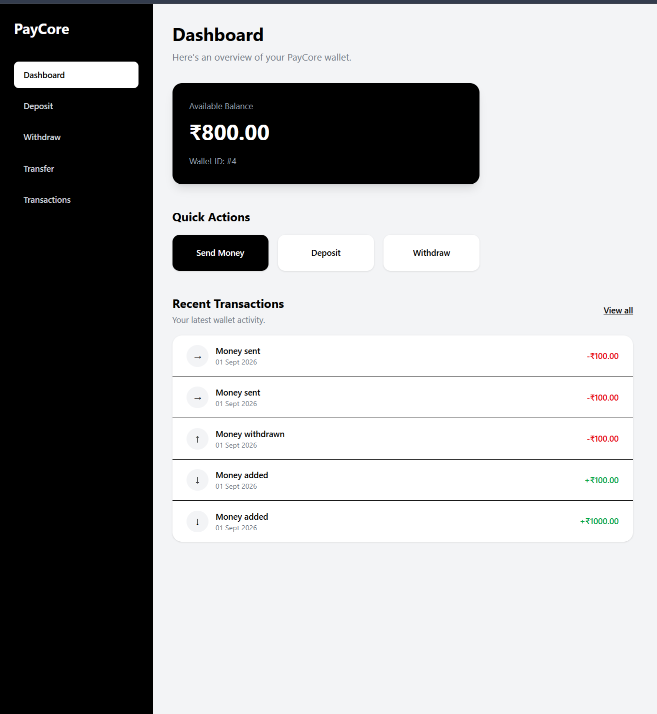
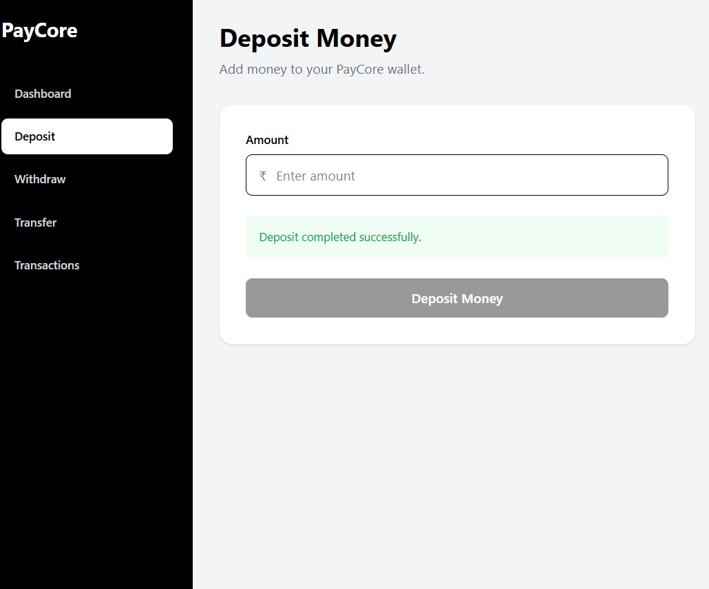
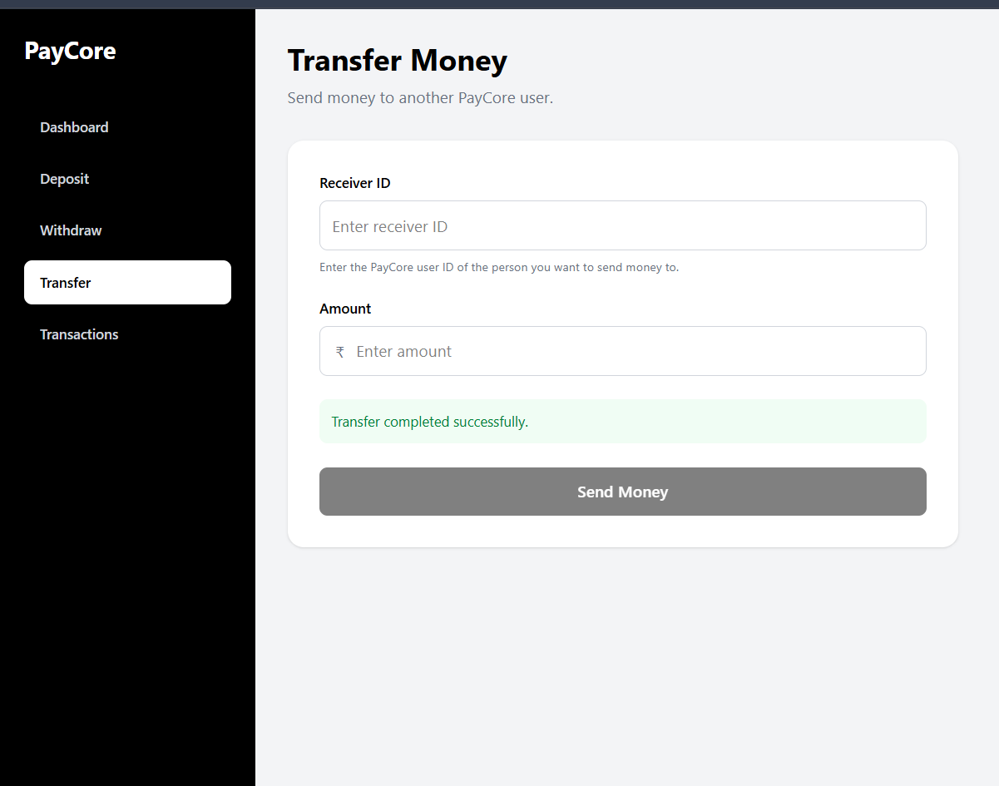
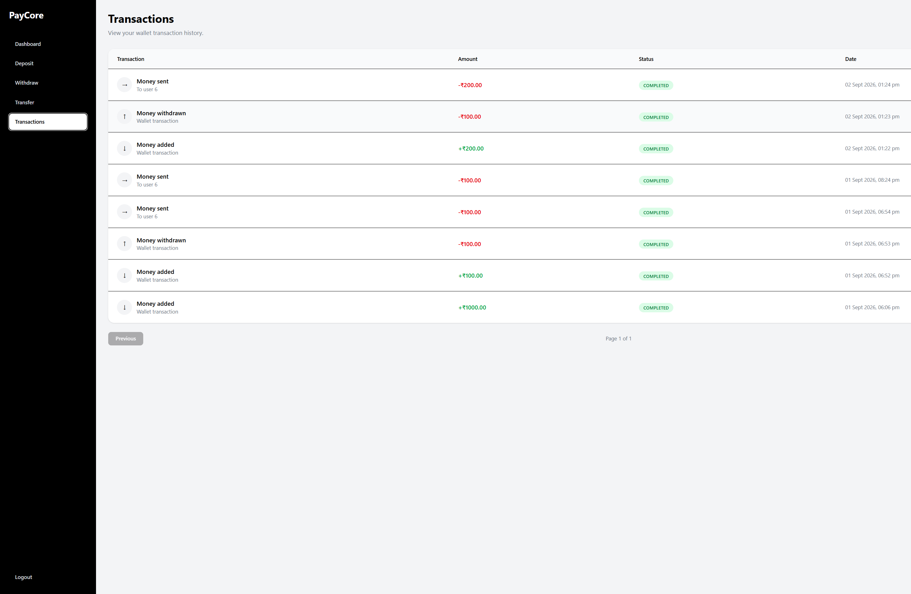
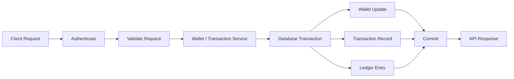

# 💳 Paycore

### Full-Stack Payment & Wallet Platform

Paycore is a full-stack payment and wallet platform built around the backend engineering problems that make financial operations difficult: **transactional consistency, concurrent wallet updates, idempotency, ledger tracking, authentication, and reconciliation**.

The project combines a **Spring Boot backend**, **MySQL persistence**, and a **React + TypeScript frontend** with Dockerized deployment and GitHub Actions CI.

---

## 📸 Screenshots

> Add your real application screenshots here. Recommended files:
>
> - `docs/images/dashboard.png`
> - `docs/images/deposit.png`
> - `docs/images/transfer.png`
> - `docs/images/transactions.png`

### 💰 Dashboard



### 💸 Deposit / Withdrawal



### 🔄 Transfer



### 📜 Transactions



---

## 🎯 What is Paycore?

A payment system is not difficult because updating a balance is difficult.

It is difficult because multiple requests can operate on the **same financial state** while clients may retry requests, transactions can fail, and the system still has to preserve a consistent record of what happened.

Paycore focuses on these problems:

- ❌ Incorrect balances caused by concurrent updates
- ❌ Duplicate processing of retried operations
- ❌ Partial updates between wallet and financial records
- ❌ Invalid withdrawals that exceed available balance
- ❌ Unauthenticated access to financial operations
- ❌ Undetected inconsistencies between wallet state and transaction records
- ✅ Transactional and auditable money movement

---

## 🏗️ Project Architecture

### Backend — Spring Boot

```text
src/main/java/com/shravan/paycore/
│
├── config/
│   ├── JwtAuthenticationFilter.java
│   └── SecurityConfig.java
│
├── controller/
│   ├── TransactionController.java
│   ├── UserController.java
│   └── WalletController.java
│
├── dto/
│   ├── DepositRequest.java
│   ├── ErrorResponse.java
│   ├── LoginRequest.java
│   ├── LoginResponse.java
│   ├── RegisterUserRequest.java
│   ├── TransactionResponse.java
│   ├── TransferRequest.java
│   ├── UserResponse.java
│   ├── WalletConsistencyResponse.java
│   ├── WalletResponse.java
│   └── WithdrawRequest.java
│
├── entity/
│   ├── IdempotencyRecord.java
│   ├── LedgerEntry.java
│   ├── Transaction.java
│   ├── User.java
│   └── Wallet.java
│
├── enums/
│   ├── LedgerEntryType.java
│   ├── Role.java
│   ├── TransactionStatus.java
│   └── TransactionType.java
│
├── exception/
│   ├── DuplicateIdempotencyKeyException.java
│   ├── GlobalExceptionHandler.java
│   ├── InsufficientBalanceException.java
│   ├── InvalidCredentialsException.java
│   ├── UserNotFoundException.java
│   └── WalletNotFoundException.java
│
├── repository/
│   ├── IdempotencyRecordRepository.java
│   ├── LedgerEntryRepository.java
│   ├── TransactionRepository.java
│   ├── UserRepository.java
│   └── WalletRepository.java
│
└── service/
    ├── AuthenticatedUserService.java
    ├── JwtService.java
    ├── ReconciliationService.java
    ├── TransactionService.java
    ├── UserService.java
    └── WalletService.java
```

### Frontend — React + TypeScript

```text
frontend/src/
│
├── api/
│   ├── auth.ts
│   ├── authApi.ts
│   ├── axios.ts
│   ├── depositApi.ts
│   ├── registerApi.ts
│   ├── transactionApi.ts
│   ├── transferApi.ts
│   ├── walletApi.ts
│   └── withdrawApi.ts
│
├── components/
│   └── ProtectedRoute.tsx
│
├── hooks/
│   ├── useAuth.ts
│   └── useWallet.ts
│
├── layouts/
│   ├── DashboardLayout.tsx
│   └── MainLayout.tsx
│
├── pages/
│   ├── Dashboard.tsx
│   ├── Deposit.tsx
│   ├── Login.tsx
│   ├── Register.tsx
│   ├── Transactions.tsx
│   ├── Transfer.tsx
│   └── Withdraw.tsx
│
└── types/
    ├── auth.ts
    ├── transaction.ts
    └── wallet.ts
```

---

## 🚀 Features Implemented

### 💰 Wallet & Payment Operations

- User registration and authentication
- Wallet balance management
- Deposit operations
- Withdrawal operations
- Peer-to-peer transfers
- Transaction history
- Structured transaction status and type models

### ⚡ Transaction Consistency

Financial operations are handled through the service layer with transactional boundaries so related database changes are committed or rolled back together.

The backend contains dedicated transaction and ledger models instead of treating the wallet balance as the only source of financial state.

### 🔁 Idempotency

Paycore includes dedicated idempotency persistence and duplicate-key handling:

- `IdempotencyRecord`
- `IdempotencyRecordRepository`
- `DuplicateIdempotencyKeyException`

This provides a foundation for making retrying financial requests distinguishable from genuinely new operations.

### 📒 Ledger & Reconciliation

Financial activity is represented using:

- `Transaction`
- `LedgerEntry`
- `LedgerEntryType`
- `TransactionType`
- `TransactionStatus`

A dedicated `ReconciliationService` and scheduled `ReconciliationJob` support consistency checks between wallet state and recorded financial activity.

### 🔒 Authentication & Security

- Spring Security
- JWT authentication
- JWT request filtering
- Protected frontend routes
- Authenticated-user service
- Centralized exception handling

### 🧪 Validation & Error Handling

Dedicated exceptions are used for important business failures, including:

- insufficient wallet balance
- missing wallet
- missing user
- invalid credentials
- duplicate idempotency keys

API failures are normalized through a global exception handler.

### 🎨 Frontend

- React + TypeScript
- TanStack Query hooks
- Axios API client
- React Router
- Protected routes
- Separate pages for dashboard, deposit, withdrawal, transfer, login, registration, and transactions

---

## 🛠️ Technology Stack

| Component | Technology | Purpose |
|---|---|---|
| Language | Java | Backend application |
| Backend | Spring Boot | REST API & business logic |
| Security | Spring Security + JWT | Authentication & authorization |
| ORM | Spring Data JPA / Hibernate | Persistence layer |
| Database | MySQL | Persistent wallet, transaction, ledger and user data |
| Frontend | React + TypeScript | User interface |
| Data Fetching | TanStack Query | Server-state management |
| HTTP Client | Axios | Frontend API communication |
| Routing | React Router | Client-side navigation |
| Styling | Tailwind CSS | Frontend styling |
| Testing | JUnit / Mockito | Automated backend tests |
| API Testing | Postman | API collections and workflows |
| Build | Maven | Backend build |
| Containers | Docker / Docker Compose | Local and deployment environment |
| CI | GitHub Actions | Automated build/test pipeline |

---

## 🔄 Money Movement Flow

A typical wallet operation follows this high-level flow:

```text
Client Request
      │
      ▼
Controller
      │
      ▼
Authentication / Validation
      │
      ▼
Service Layer
      │
      ├──────────────► Wallet State
      │
      ├──────────────► Transaction Record
      │
      └──────────────► Ledger Entry
      │
      ▼
Database Commit
```

The important design goal is that a financial operation should not leave the application in a state where the wallet changed but the corresponding financial record did not.

---

## ⚔️ Concurrency & Consistency

Wallet balances are shared mutable state.

Consider a wallet with:

```text
Balance = ₹1,000
```

Two requests arrive at nearly the same time:

```text
Request A → Withdraw ₹800
Request B → Withdraw ₹800
```

A naive read-modify-write implementation can allow both requests to observe the same starting balance.

Paycore treats concurrent wallet operations as a correctness problem and places the protection at the persistence/transaction boundary.

### Invariants

```text
Successful withdrawal
    → balance must remain valid

Failed withdrawal
    → wallet state must not be partially updated

Financial operation
    → transaction / ledger state must stay consistent
```

> The repository currently contains wallet service tests. A dedicated multi-threaded concurrency stress test is the next strongest test to add if you want to demonstrate concurrent correctness quantitatively.

---

## 📒 Ledger Model

The system separates current wallet state from recorded financial activity.

```text
User
 │
 └── Wallet
      │
      ├── current balance
      │
      └── financial operations
             │
             ├── Transaction
             │
             └── LedgerEntry
```

This makes reconciliation possible instead of relying only on the current balance.

---

## 🔐 Authentication Flow

```text
Login / Register
      │
      ▼
UserController
      │
      ▼
UserService / JwtService
      │
      ▼
JWT
      │
      ▼
Protected Frontend Route
      │
      ▼
JwtAuthenticationFilter
      │
      ▼
Authenticated Service Operation
```

---

## 📋 API Surface

The backend exposes three main controller areas:

### 👤 User

`UserController`

Handles:

- user registration
- authentication-related user operations
- user responses

### 💰 Wallet

`WalletController`

Handles:

- wallet access
- balance retrieval
- deposit
- withdrawal

### 🔄 Transactions

`TransactionController`

Handles:

- transaction access
- transfers
- transaction responses

The repository also includes request/response DTOs for deposits, withdrawals, transfers, authentication, wallet responses, transaction responses, and consistency checks.

For executable examples, use the Postman assets under:

```text
postman/
```

---

## 🧪 Testing

Current backend tests include:

```text
src/test/java/
├── com/shravan/paycore/
│   └── PaycoreApplicationTests.java
│
└── service/
    └── WalletServiceTest.java
```

Run the test suite:

### Windows

```powershell
.\mvnw.cmd test
```

### macOS / Linux

```bash
./mvnw test
```

---

## 🎮 How to Test a Wallet Operation

### Scenario 1 — Successful Deposit

1. Authenticate a user.
2. Submit a deposit request.
3. Verify the wallet balance.
4. Verify the transaction/ledger records.

✅ **Expected:** balance and financial records reflect the operation.

### Scenario 2 — Insufficient Balance

1. Use a wallet with a known balance.
2. Attempt a withdrawal larger than the available balance.
3. Verify the request is rejected.
4. Verify the balance has not been incorrectly reduced.

✅ **Expected:** `InsufficientBalanceException` path is triggered and wallet state remains valid.

### Scenario 3 — Repeated Idempotency Key

1. Submit a supported request with an idempotency key.
2. Retry using the same key.
3. Verify the duplicate-key path.

⚠️ **Expected:** the backend recognizes the duplicate instead of blindly treating it as an unrelated request.

---

## 🧪 Testing Flow



---

## 🐳 Docker

Paycore includes:

```text
Dockerfile
docker-compose.yml
```

The deployment setup is designed to run the Spring Boot application together with MySQL.

Start the environment:

```bash
docker compose up -d --build
```

Check services:

```bash
docker compose ps
```

View application logs:

```bash
docker compose logs paycore
```

Stop the environment:

```bash
docker compose down
```

---

## 🔄 Continuous Integration

The repository includes a GitHub Actions workflow:

```text
.github/workflows/ci.yml
```

High-level CI flow:

```text
Push / Pull Request
        │
        ▼
GitHub Actions
        │
        ▼
Build Project
        │
        ▼
Start MySQL Service
        │
        ▼
Run Automated Tests
        │
        ▼
✅ Pass / ❌ Fail
```

This ensures the backend is continuously verified in a clean CI environment rather than only on the developer's machine.

---

## 📁 Repository Structure

```text
Paycore/
│
├── .github/
│   └── workflows/
│       └── ci.yml
│
├── frontend/
│   ├── src/
│   ├── package.json
│   └── package-lock.json
│
├── postman/
│   ├── collections/
│   ├── documents/
│   ├── environments/
│   ├── flows/
│   ├── globals/
│   ├── mocks/
│   └── specs/
│
├── job/
│   └── ReconciliationJob.java
│
├── src/
│   ├── main/
│   │   ├── java/
│   │   └── resources/
│   └── test/
│
├── Dockerfile
├── docker-compose.yml
├── pom.xml
└── mvnw
```

---

## 🧠 Key Engineering Decisions

### Why a service layer?

Business rules are kept out of controllers so wallet, transaction, authentication, and reconciliation logic remain separately testable.

### Why separate transaction and ledger models?

A wallet balance represents current state. Transaction and ledger records preserve the financial history required for tracing and reconciliation.

### Why idempotency records?

Retries are normal in distributed applications. A request identifier gives the backend a way to distinguish repeated operations from new ones.

### Why reconciliation?

Even when business logic is intended to preserve consistency, financial systems benefit from an explicit mechanism that can detect unexpected differences between derived state and recorded activity.

### Why CI with MySQL?

Database-backed behavior should be exercised against the actual persistence dependency in CI rather than relying only on local development.

---

## ⚠️ Project Scope

Paycore is an engineering project demonstrating payment-system concepts.

It is **not a production payment processor** and does not claim to provide the full infrastructure required for real-world regulated financial systems.

Areas outside the current scope include:

- external payment gateway settlement
- fraud detection
- regulatory compliance
- distributed multi-region failover
- production secrets management
- event-driven outbox processing
- high-scale observability infrastructure

---

## 🔮 Future Improvements

The next engineering improvements I'd prioritize are:

1. **Multi-threaded concurrency tests** using `ExecutorService`
2. **Integration tests against MySQL**
3. **Transactional outbox pattern**
4. **OpenAPI / Swagger documentation**
5. **Metrics, logging and tracing**
6. **Production-grade secret management**
7. **More comprehensive reconciliation reporting**

---

## 👨‍💻 Author

### Shravan Lunawat

Engineering student focused on backend development, databases, concurrency, distributed-systems concepts, and building production-style Java applications.

**GitHub:** [shravan-dev16](https://github.com/shravan-dev16)

---

## ⭐ Why this project?

Paycore is deliberately built around a simple question:

> **What happens when money-moving operations fail, retry, or happen concurrently?**

The project uses that question to explore transaction boundaries, persistence consistency, idempotency, ledger design, authentication, testing, containerization, and continuous integration.
